# ArchiRAG: Toward Evidence-Grounded Architectural Review with Multimodal Retrieval-Augmented Reasoning
> 
Abstract: Automated domain-specific knowledge question answering in the architecture, engineering, and construction (AEC) domain relies on heterogeneous multi-modal documents, including codes, technical specifications, drawings, and performance reports. However, existing architectural AI methods still face significant challenges, as they struggle with text-graphic misalignment, multi-step compliance reasoning, and evidence scattered across multiple documents. To bridge this gap, we construct ArchInstruct-QA, a dataset comprising architecture-oriented question-answer pairs. Building on this dataset, we propose ArchiRAG, a multi-modal retrieval-augmented framework that integrates multi-modal evidence units, adaptive hybrid retrieval, multi-hop evidence planning, and role-specific agents for grounded answer generation. ArchiRAG outperforms graph-based retrieval methods and lightweight RAG baselines in evidence alignment, retrieval precision, and long-context reasoning consistency, demonstrating its potential for automated architectural review workflows.

[**Paper**]() | [**Project Page**]() | [**Model Weights**]() | [**Huggingface Demo**]() |

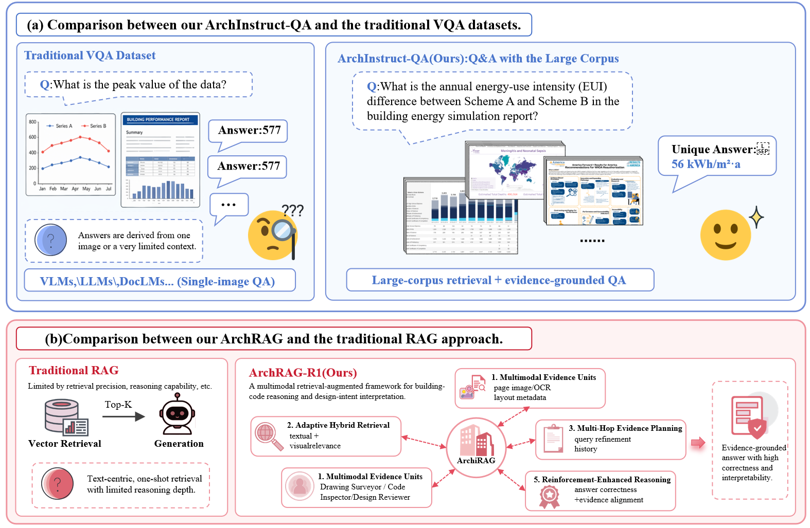
*Figure 1) Motivation of ArchInstruct-QA and ArchiRAG.*  

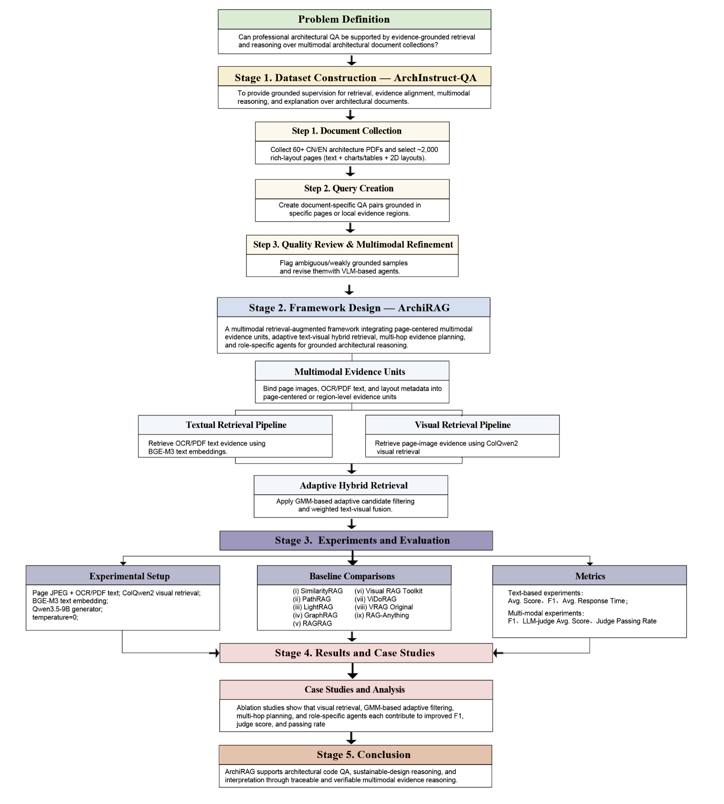
*Figure 2) Overall Research Flowchart.*  

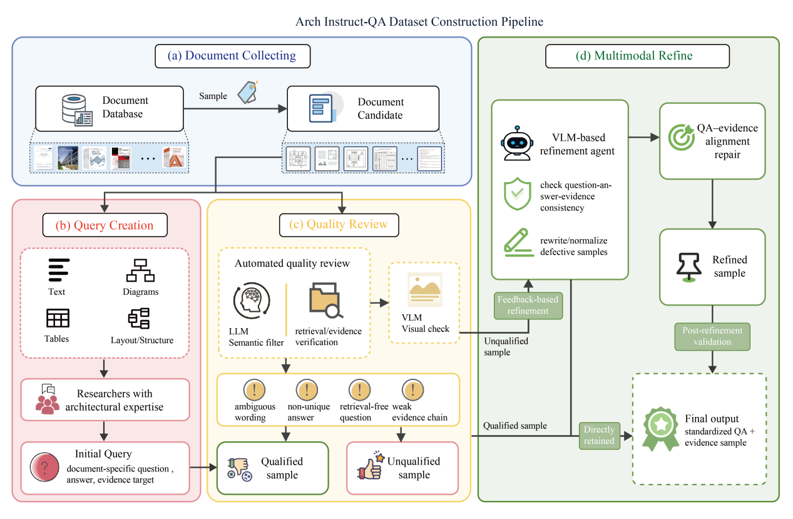
*Figure 3) Construction Pipeline of the ArchInstruct-QA Dataset.*  

*Figure 4) Document Base and Knowledge Coverage of ArchInstruct-QA.*  

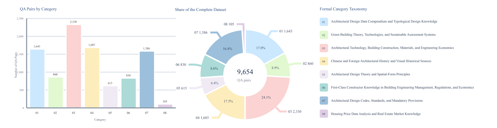
*Figure 5) Distribution of ArchInstruct-QA by Evidence Modality and Reasoning Type.*  

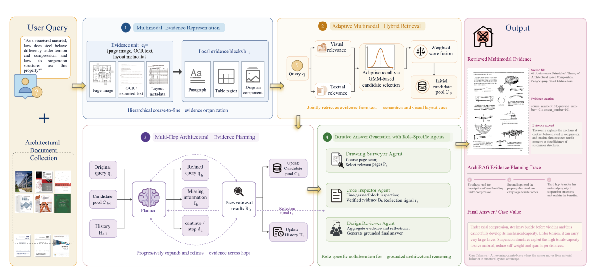
*Figure 6) The ArchiRAG Framework.*  

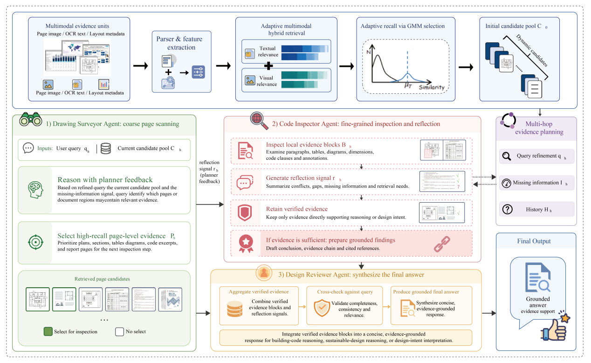
*Figure 7) Role-Specific Multi-Agent Reasoning Workflow in ArchiRAG.*  

## Table 2. Performance comparison of text-based RAG methods on architectural QA tasks

| Method | Avg. Score (0-10) | F1 (%) | Avg. Time (s) |
|---|---:|---:|---:|
| PathRAG_BGE-M3 [10] | 7.4216 | 65.14 | 35.8072 |
| PathRAG_JINA-EMBEDDINGS-V3 [10] | 7.7029 | 68.27 | 30.6849 |
| LightRAG_BGE-M3 [11] | 7.9824 | 71.13 | 57.3185 |
| LightRAG_JINA-EMBEDDINGS-V3 [11] | 8.0647 | 72.48 | 52.1064 |
| GraphRAG_BGE-M3 [12] | 5.6918 | 49.26 | 262.4387 |
| GraphRAG_JINA-EMBEDDINGS-V3 [12] | 5.2849 | 45.68 | 521.7469 |
| SimilarityRAG_BGE-M3 [9] | 7.1046 | 62.17 | 14.9238 |
| SimilarityRAG_JINA-EMBEDDINGS-V3 [9] | 7.2963 | 63.89 | 17.8426 |
| **ArchiRAG-Text_BGE-M3** | **8.3517** | **74.16** | 24.6325 |
| ArchiRAG-Text_JINA-EMBEDDINGS-V3 | 7.8886 | 70.69 | 27.3481 |

## ArchiRAG Representative Evidence-Grounded Cases

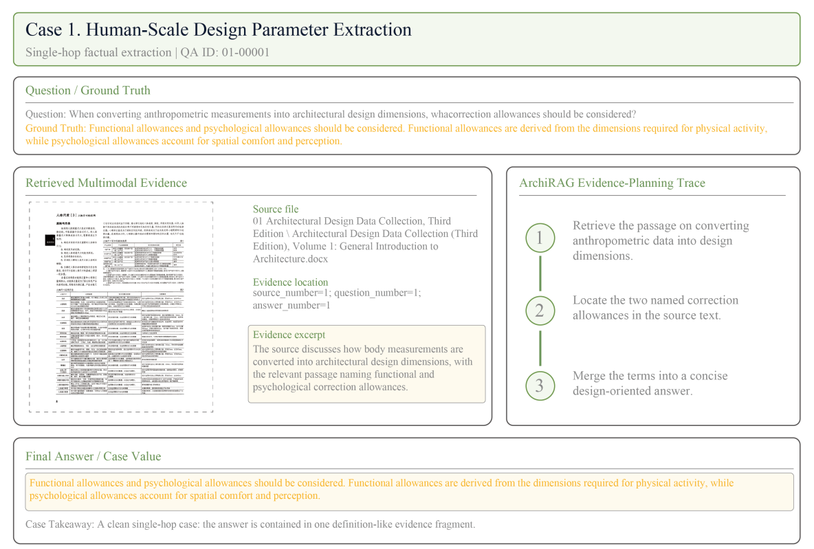
*Figure 8) Representative ArchiRAG case for human-scale design parameter extraction.*  

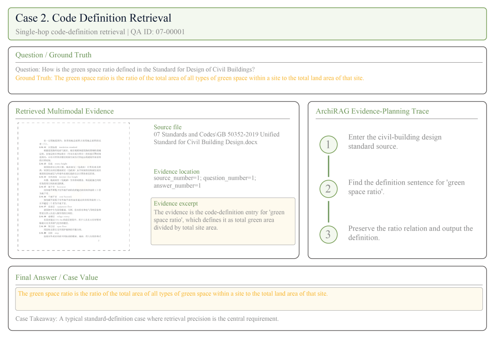
*Figure 9) Representative ArchiRAG case for code definition retrieval.*  

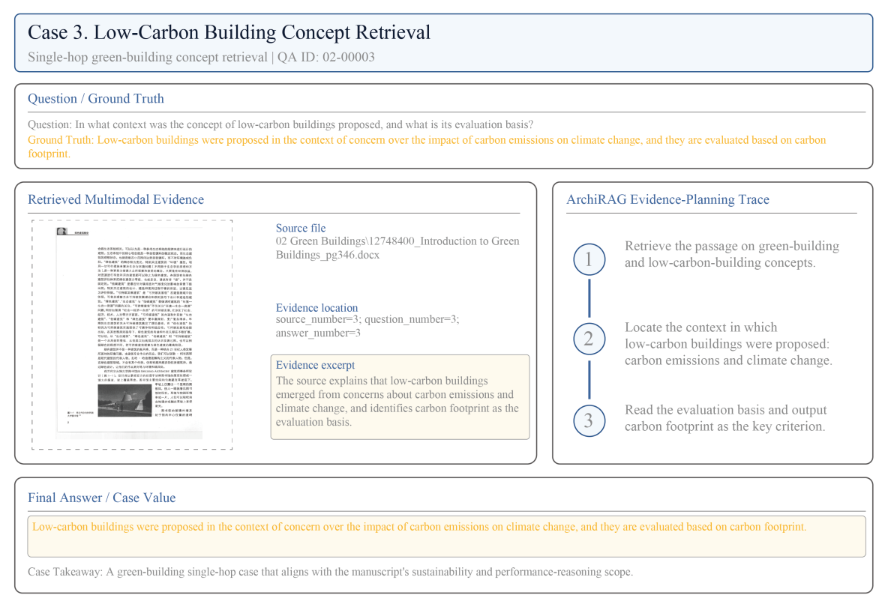
*Figure 10) Representative ArchiRAG case for code definition retrieval.*  

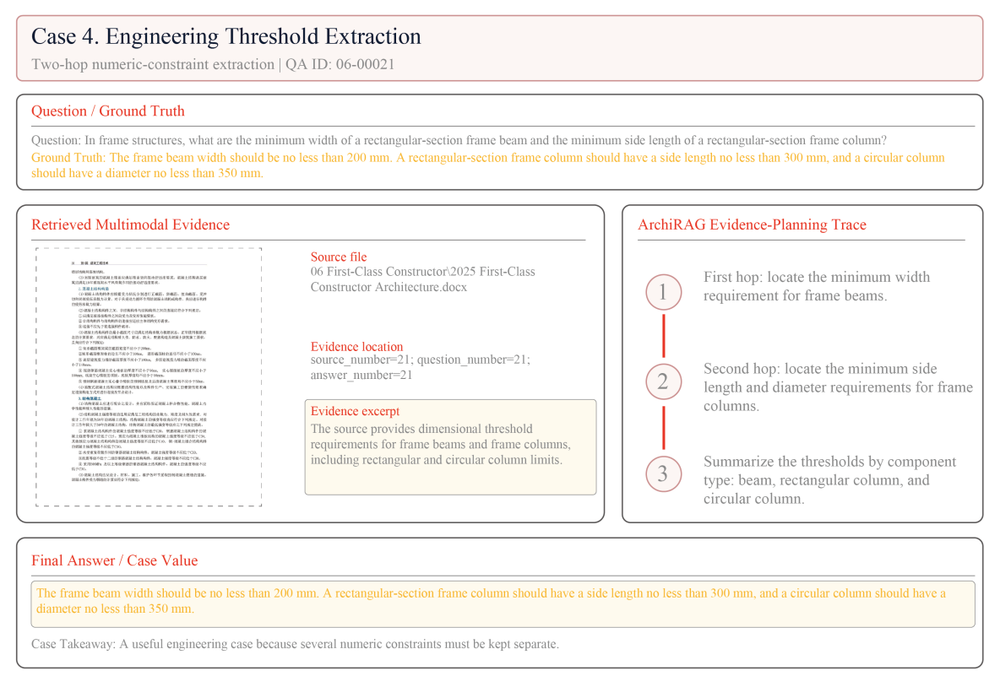
*Figure 11) Representative ArchiRAG case for code definition retrieval.*  

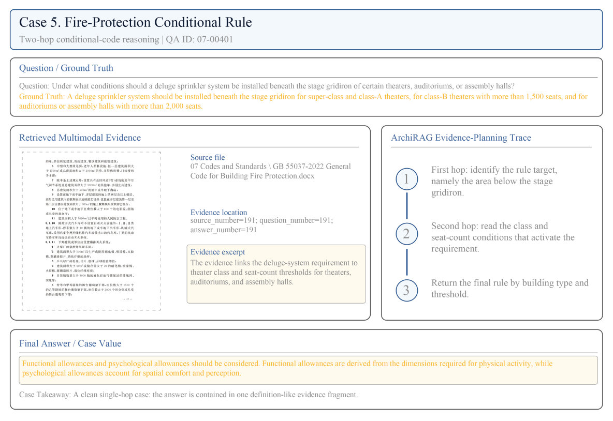
*Figure 12) Representative ArchiRAG case for code definition retrieval.*  

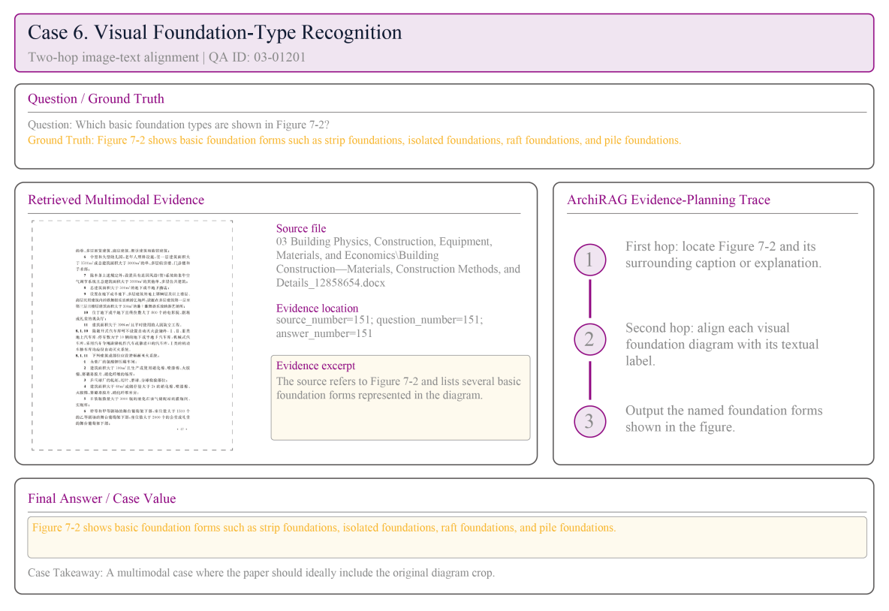
*Figure 13) Representative ArchiRAG case for code definition retrieval.*  

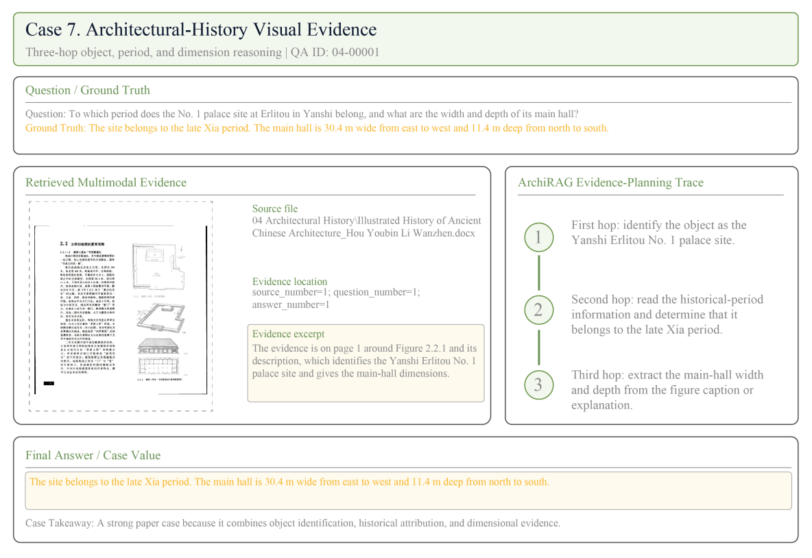
*Figure 14) Representative ArchiRAG case for code definition retrieval.*  

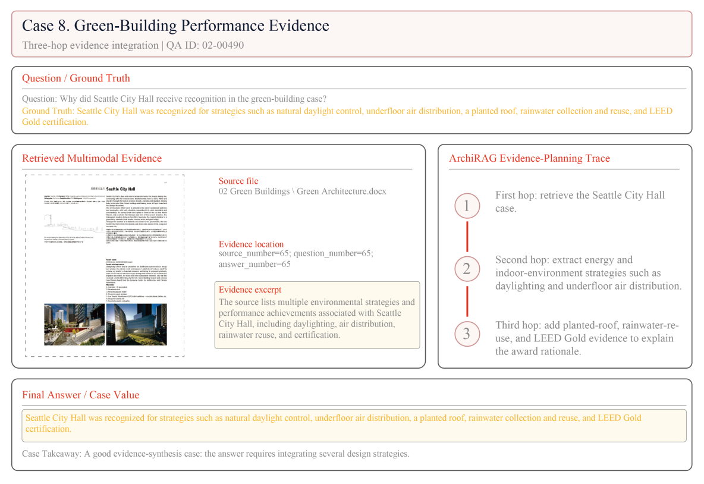
*Figure 15) Representative ArchiRAG case for code definition retrieval.*  

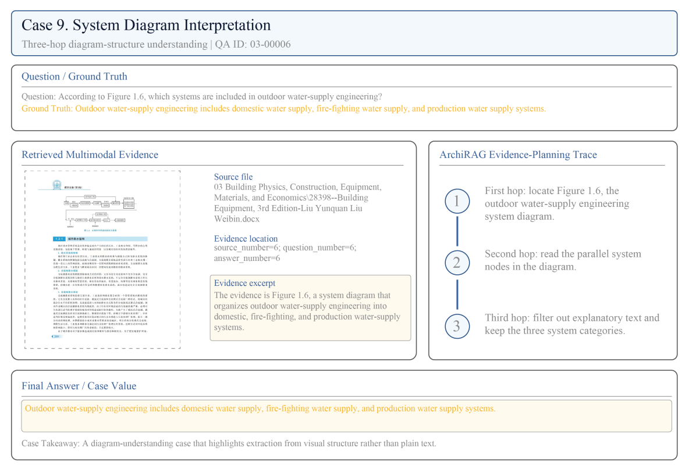
*Figure 16) Representative ArchiRAG case for code definition retrieval.*  

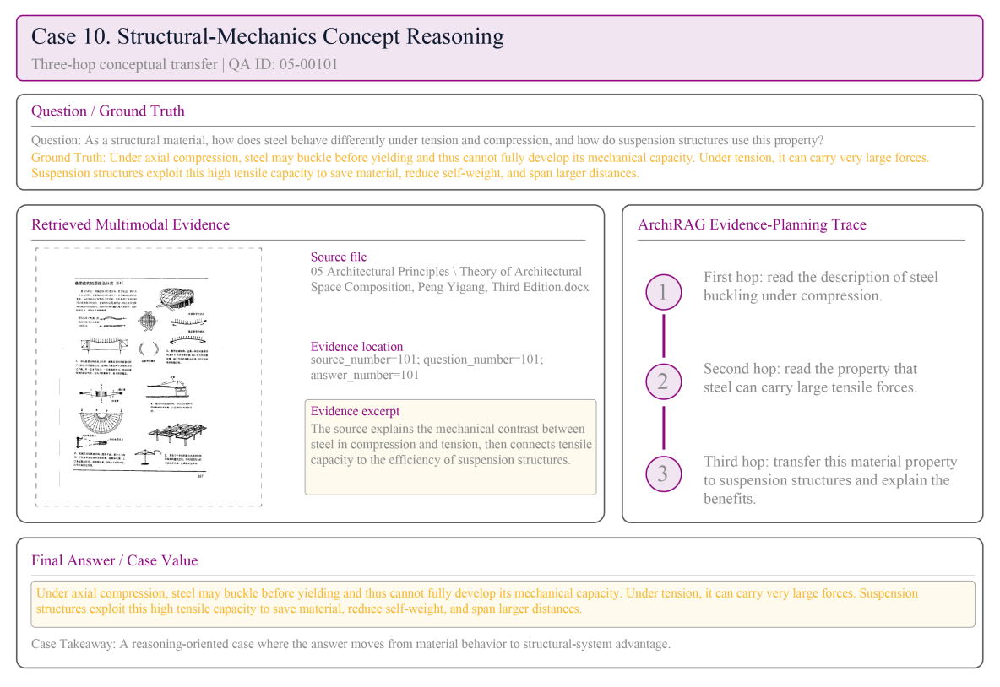
*Figure 17) Representative ArchiRAG case for code definition retrieval.*  

## TODO List

- [x] Release part of ArchiRAG dataset. 
- [ ] Release ArchiRAG inference code and pretrain weights.
- [ ] Upload ArchiRAG training dataset.
- [ ] Release ArchiRAG code.

